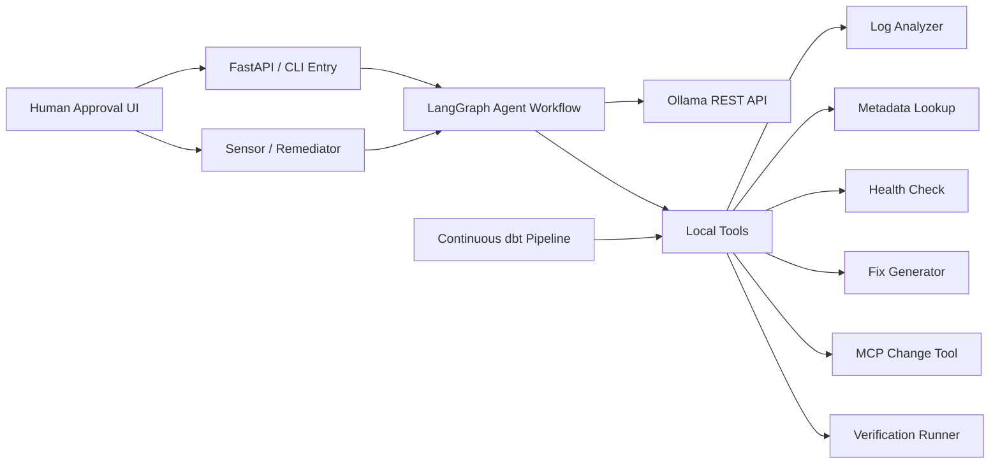
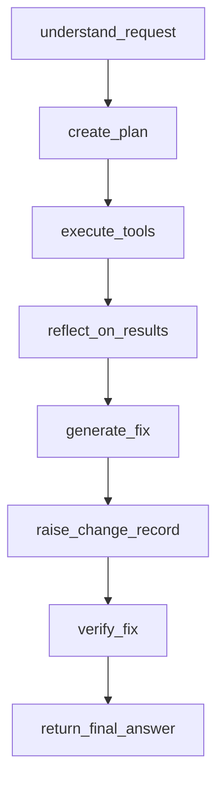
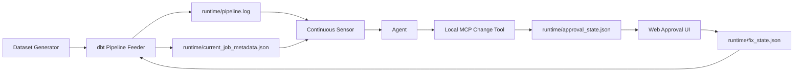

# agentic-ai-ollama-demo

A minimal open-source project that demonstrates a fully local agentic AI system for data engineering incident response using Ollama, LangGraph, FastAPI, and Docker.

This repo is built for live demos, workshops, and teaching. It shows the full agent loop end-to-end without relying on any external API.

It now includes two demo modes:

- a simple single-run incident investigation
- a closed-loop banking pipeline with a continuous sensor, operator approval, and a dramatic web control room

The demo walks through a realistic lifecycle:

User Request -> Goal Understanding -> Planning -> Tool Execution -> Reflection / Health Check -> Fix Generation -> MCP Change Record -> Human Approval -> Verification -> Final Result

## Why This Repo Exists

Most agent demos either skip orchestration or depend on hosted APIs. This project keeps the architecture honest while staying lightweight enough to explain in a few minutes.

It is designed to be:

- fully local
- simple enough for a live walkthrough
- realistic enough to teach agent design patterns
- stable enough to demo repeatedly

## What The Agent Does

The agent investigates a failing nightly customer ETL job, correlates logs and metadata, reasons about infrastructure health, proposes a fix, simulates a rerun, and returns a structured operational summary.

In the closed-loop mode, a second application continuously runs a dbt banking pipeline and writes fresh logs. A sensor watches those logs, calls the agent when a run fails, raises an MCP-backed change record for the remediation, and waits for human approval before the next cycle recovers.

The FastAPI service also serves a live operator dashboard at `http://localhost:8000`.

## Overview

This project simulates a data engineering support agent investigating a failed nightly customer ETL pipeline. The agent uses a local LLM through the Ollama REST API for goal understanding and planning, then combines deterministic tools for log analysis, metadata inspection, health checks, fix generation, and verification.

Everything runs locally. There are no external API dependencies.

## Tech Stack

- Python 3.11
- FastAPI
- LangGraph
- LangChain Core
- Ollama
- Docker Compose
- dbt Core
- dbt DuckDB

## Agentic AI Phases

1. Goal understanding: Convert the incoming request into an operational investigation goal.
2. Planning: Create a short plan that uses the available local tools.
3. Tool execution: Read pipeline logs, inspect metadata, and simulate system health checks.
4. Reflection: Correlate evidence and identify the most likely root cause.
5. Fix generation: Propose a concrete remediation.
6. Change control: Open a change record through a local MCP tool.
7. Verification: Verify recovery after the approved change is applied.
8. Final answer: Return a concise operational summary.

## Demo Story

Example request:

`Why did the nightly customer ETL job fail and how do we fix it?`

Expected diagnosis:

- The pipeline fails in the transform stage.
- Logs show `OutOfMemoryError` and `OOMKilled`.
- Metadata shows a heavy aggregation workload with only 4GB executor memory.
- Health checks show the platform is healthy but workers are under memory pressure.
- The recommended fix is to increase executor memory and rerun the job.
- Verification confirms the simulated rerun succeeds.

## Closed-Loop Banking Demo

The extended demo uses banking entities and a dbt pipeline:

- `bank_customers`
- `bank_accounts`
- `bank_transactions`
- `bank_loans`

The flow is:

1. Generate a banking dataset scenario.
2. The `pipeline` app continuously runs a dbt project and writes runtime logs.
3. The `sensor` app watches for failed runs.
4. On failure, the sensor invokes the agent using the latest runtime log and metadata.
5. The agent recommends a fix and raises a change record through a local MCP tool.
6. The operator approves or rejects the change record in the web UI.
7. Only after the change is approved is the fix applied for the next dbt cycle.
8. The next dbt cycle succeeds, demonstrating closed-loop behavior.

Available scenarios:

- `baseline`: healthy pipeline
- `memory_stress`: intentionally fails first, then recovers after remediation
- `fraud_spike`: succeeds with a riskier banking dataset

## Quickstart

### Docker-first path

```bash
docker compose up --build -d
./scripts/setup.sh
./scripts/run_demo.sh
```

### Closed-loop path

```bash
./scripts/start_closed_loop.sh memory_stress
docker compose logs -f pipeline sensor
```

Generate a different banking dataset on demand:

```bash
./scripts/load_dataset.sh baseline
./scripts/load_dataset.sh fraud_spike
./scripts/load_dataset.sh memory_stress
```

Open the live control room:

`http://localhost:8000`

### Manual commands

```bash
docker compose up --build -d
docker compose exec -T ollama ollama pull llama3.2:3b
./scripts/run_demo.sh "Why did the nightly customer ETL job fail and how do we fix it?"
```

## End-To-End Run

Use this sequence when you want the full control-room story from healthy system to approved recovery.

### 1. Start the stack

```bash
cd /Users/ranjitpillai/codexmap/agentic-ai-ollama-demo
docker compose up --build -d
./scripts/setup.sh
```

This starts:

- `ollama` for the local model
- `agent` for the API and web UI
- `pipeline` for the continuous dbt job
- `sensor` for failure detection and agent invocation

### 2. Open the UI

Open:

`http://localhost:8000`

The system should settle into a healthy monitoring state if no incident is active.

### 3. Reset to a clean baseline

Use the `Reset Incident` button in the UI, then click `Healthy`.

Equivalent command-line path:

```bash
./scripts/load_dataset.sh baseline
```

Expected result:

- pipeline status stays healthy
- the agent timeline is sleeping
- no remediation panel is shown

### 4. Trigger a failing incident

Click `Memory Stress` in the UI.

Equivalent command-line path:

```bash
./scripts/load_dataset.sh memory_stress
```

Expected result:

- the next dbt cycle fails
- the sensor invokes the agent
- the agent analyzes logs and metadata
- the agent raises an MCP change record
- the UI moves to `Change Approval Required`

### 5. Review the change record

In the `Remediation` tab, review:

- the change ID
- the proposed actions
- the rationale
- the MCP change-record status

At this point the fix is **not** applied yet.

### 6. Approve the change

Click `Approve Change`.

What happens next:

- the MCP change record is updated to `approved`
- only then is the fix written into `runtime/fix_state.json`
- the next pipeline cycle runs with the approved remediation

### 7. Watch recovery

Stay on the `Overview` tab and keep `Live Mode` on.

Expected result:

- the next cycle succeeds
- the incident banner clears
- the approval state disappears
- the visible cognition returns to a sleeping agent

### 8. Trigger another demo run

For a clean replay:

1. Click `Reset Incident`
2. Click `Healthy` to return to baseline
3. Click `Memory Stress` when you want the next failure

### 9. Follow logs during the run

```bash
docker compose logs -f pipeline sensor agent
```

This is useful while demoing the UI because it shows:

- dbt cycle starts and failures
- sensor detection
- agent completion
- MCP-backed change approval flow
- post-approval recovery

## Architecture



## Agent Workflow



Graphviz-friendly edge list:


Closed-loop runtime:



## Web UI

The control room at `http://localhost:8000` is designed to make the demo legible in real time.

It shows:

- a dramatic incident banner when the banking pipeline fails
- live pipeline status and scenario context
- the agent's LangGraph phase timeline
- a human-in-the-loop approval panel for MCP change records
- an event stream with critical, warning, and recovery moments
- the raw pipeline log tail

## Repository Structure

```text
agentic-ai-ollama-demo/
├── README.md
├── Dockerfile
├── docker-compose.yml
├── requirements.txt
├── .env.example
├── agent/
│   ├── main.py
│   ├── agent_graph.py
│   ├── tools.py
│   ├── planner.py
│   ├── healthcheck.py
│   └── reflection.py
├── data/
│   ├── sample_pipeline_logs.txt
│   └── sample_job_metadata.json
├── dbt_demo/
│   ├── dbt_project.yml
│   ├── profiles.yml
│   ├── models/
│   └── seeds/generated/
├── runtime/
├── simulator/
│   ├── change_mcp_client.py
│   ├── change_mcp_server.py
│   ├── dataset_generator.py
│   ├── pipeline_feeder.py
│   └── sensor_app.py
├── ui/
│   ├── index.html
│   ├── app.js
│   └── styles.css
└── scripts/
    ├── load_dataset.sh
    ├── setup.sh
    ├── start_closed_loop.sh
    └── run_demo.sh
```

## How To Run

### 1. Start Ollama and the agent service

```bash
docker compose up --build -d
```

### 2. Pull a local model

If you are using the Docker Compose stack, load the model into the Ollama container:

```bash
./scripts/setup.sh
```

Equivalent manual command:

```bash
docker compose exec -T ollama ollama pull llama3.2:3b
```

If you already run Ollama on the host machine instead of Docker:

```bash
ollama pull llama3.2:3b
```

### 3. Run the demo

```bash
./scripts/run_demo.sh
```

Or pass a custom prompt:

```bash
./scripts/run_demo.sh "Why did the nightly customer ETL job fail and how do we fix it?"
```

### 4. Run the closed-loop banking demo

```bash
./scripts/start_closed_loop.sh memory_stress
docker compose logs -f pipeline sensor
```

Then open:

`http://localhost:8000`

You can swap datasets at any time:

```bash
./scripts/load_dataset.sh baseline
./scripts/load_dataset.sh fraud_spike
```

### 5. Refresh services after code changes

If you change backend or UI code while the stack is running:

```bash
docker compose restart agent sensor pipeline
```

Then hard refresh the browser:

- `Cmd+Shift+R` on macOS

## Local Python Run

If you want to run the project without Docker for the agent process:

```bash
python3.11 -m venv .venv
source .venv/bin/activate
pip install -r requirements.txt
cp .env.example .env
python -m agent.main "Why did the nightly ETL pipeline fail?"
```

## What You Will See

The demo prints clearly separated sections:

- `----- GOAL -----`
- `----- PLAN -----`
- `----- TOOL EXECUTION -----`
- `----- REFLECTION -----`
- `----- FIX -----`
- `----- VERIFICATION -----`

The expected story is:

- the log analyzer detects an out-of-memory failure
- metadata confirms the ETL stage is memory-heavy
- health checks show the platform is healthy overall
- the fix generator recommends increasing executor memory
- the agent raises an MCP change record before any fix is applied
- verification remains blocked until the change is approved

In the closed-loop demo:

- the `pipeline` service continuously runs dbt and writes banking pipeline logs
- the `memory_stress` dataset causes the first `mart_customer_360` build to fail
- the `sensor` service detects the failure and invokes the agent
- the agent writes a remediation report to `runtime/latest_agent_report.txt`
- the web UI pauses on a human approval step for the change record
- your approval updates the MCP change record and then writes the fix into `runtime/fix_state.json`
- the next pipeline cycle succeeds

## FastAPI Endpoints

- `GET /`
- `GET /health`
- `GET /api/dashboard`
- `POST /api/approval/approve`
- `POST /api/approval/reject`
- `POST /api/run`
- `POST /run`

Example:

```bash
curl -X POST http://localhost:8000/run \
  -H "Content-Type: application/json" \
  -d '{"prompt":"Why did the nightly customer ETL job fail and how do we fix it?"}'
```

## Design Notes

- Ollama is accessed directly through its REST API using `requests`.
- LangGraph manages the stateful workflow and visible node transitions.
- The tools are deterministic to keep the demo stable in front of an audience.
- The LLM is used where it adds value for teaching: goal understanding and planning.
- dbt gives the pipeline side of the demo a realistic warehouse transformation layer.
- The simulator writes runtime state into shared files so the sensor and agent can collaborate without external infrastructure.
- The UI exposes the agent phases and approval boundary so the system feels observable instead of opaque.

## Good Demo Prompts

```bash
./scripts/run_demo.sh "Why did the nightly ETL pipeline fail?"
./scripts/run_demo.sh "Why did the nightly customer ETL job fail and how do we fix it?"
./scripts/run_demo.sh "Investigate the failed batch pipeline and recommend a remediation."
./scripts/load_dataset.sh memory_stress
./scripts/start_closed_loop.sh memory_stress
```

## Future Extensions

- persist runs and traces for replay
- swap in a vector store for operational runbooks
- add branching fix strategies and retry policies
- store sensor events in a small database instead of flat runtime files

## Final Commands

```bash
docker compose up --build -d
./scripts/setup.sh
./scripts/run_demo.sh
```

Closed-loop commands:

```bash
docker compose up --build -d ollama agent pipeline
./scripts/setup.sh
./scripts/load_dataset.sh memory_stress
docker compose up -d sensor
docker compose logs -f pipeline sensor
```

Requested host-based alternative:

```bash
ollama pull llama3.2
docker compose up --build
./scripts/run_demo.sh
```
