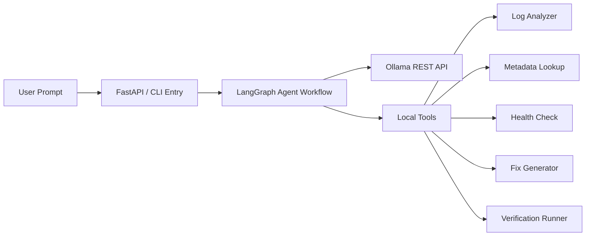
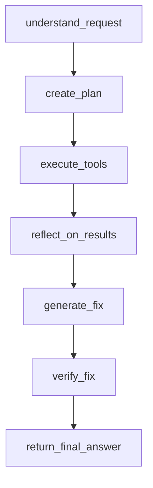

# agentic-ai-ollama-demo

A minimal open-source project that demonstrates a fully local agentic AI system for data engineering incident response using Ollama, LangGraph, FastAPI, and Docker.

This repo is built for live demos, workshops, and teaching. It shows the full agent loop end-to-end without relying on any external API.

The demo walks through a realistic lifecycle:

User Request -> Goal Understanding -> Planning -> Tool Execution -> Reflection / Health Check -> Fix Generation -> Verification -> Final Result

## Why This Repo Exists

Most agent demos either skip orchestration or depend on hosted APIs. This project keeps the architecture honest while staying lightweight enough to explain in a few minutes.

It is designed to be:

- fully local
- simple enough for a live walkthrough
- realistic enough to teach agent design patterns
- stable enough to demo repeatedly

## What The Agent Does

The agent investigates a failing nightly customer ETL job, correlates logs and metadata, reasons about infrastructure health, proposes a fix, simulates a rerun, and returns a structured operational summary.

## Overview

This project simulates a data engineering support agent investigating a failed nightly customer ETL pipeline. The agent uses a local LLM through the Ollama REST API for goal understanding and planning, then combines deterministic tools for log analysis, metadata inspection, health checks, fix generation, and verification.

Everything runs locally. There are no external API dependencies.

## Tech Stack

- Python 3.11
- FastAPI
- LangGraph
- LangChain Core
- Ollama
- Docker Compose

## Agentic AI Phases

1. Goal understanding: Convert the incoming request into an operational investigation goal.
2. Planning: Create a short plan that uses the available local tools.
3. Tool execution: Read pipeline logs, inspect metadata, and simulate system health checks.
4. Reflection: Correlate evidence and identify the most likely root cause.
5. Fix generation: Propose a concrete remediation.
6. Verification: Simulate rerunning the pipeline after the change.
7. Final answer: Return a concise operational summary.

## Demo Story

Example request:

`Why did the nightly customer ETL job fail and how do we fix it?`

Expected diagnosis:

- The pipeline fails in the transform stage.
- Logs show `OutOfMemoryError` and `OOMKilled`.
- Metadata shows a heavy aggregation workload with only 4GB executor memory.
- Health checks show the platform is healthy but workers are under memory pressure.
- The recommended fix is to increase executor memory and rerun the job.
- Verification confirms the simulated rerun succeeds.

## Quickstart

### Docker-first path

```bash
docker compose up --build -d
./scripts/setup.sh
./scripts/run_demo.sh
```

### Manual commands

```bash
docker compose up --build -d
docker compose exec -T ollama ollama pull llama3.2:3b
./scripts/run_demo.sh "Why did the nightly customer ETL job fail and how do we fix it?"
```

## Architecture



## Agent Workflow



Graphviz-friendly edge list:


## Repository Structure

```text
agentic-ai-ollama-demo/
├── README.md
├── Dockerfile
├── docker-compose.yml
├── requirements.txt
├── .env.example
├── agent/
│   ├── main.py
│   ├── agent_graph.py
│   ├── tools.py
│   ├── planner.py
│   ├── healthcheck.py
│   └── reflection.py
├── data/
│   ├── sample_pipeline_logs.txt
│   └── sample_job_metadata.json
└── scripts/
    ├── setup.sh
    └── run_demo.sh
```

## How To Run

### 1. Start Ollama and the agent service

```bash
docker compose up --build -d
```

### 2. Pull a local model

If you are using the Docker Compose stack, load the model into the Ollama container:

```bash
./scripts/setup.sh
```

Equivalent manual command:

```bash
docker compose exec -T ollama ollama pull llama3.2:3b
```

If you already run Ollama on the host machine instead of Docker:

```bash
ollama pull llama3.2:3b
```

### 3. Run the demo

```bash
./scripts/run_demo.sh
```

Or pass a custom prompt:

```bash
./scripts/run_demo.sh "Why did the nightly customer ETL job fail and how do we fix it?"
```

## Local Python Run

If you want to run the project without Docker for the agent process:

```bash
python3.11 -m venv .venv
source .venv/bin/activate
pip install -r requirements.txt
cp .env.example .env
python -m agent.main "Why did the nightly ETL pipeline fail?"
```

## What You Will See

The demo prints clearly separated sections:

- `----- GOAL -----`
- `----- PLAN -----`
- `----- TOOL EXECUTION -----`
- `----- REFLECTION -----`
- `----- FIX -----`
- `----- VERIFICATION -----`

The expected story is:

- the log analyzer detects an out-of-memory failure
- metadata confirms the ETL stage is memory-heavy
- health checks show the platform is healthy overall
- the fix generator recommends increasing executor memory
- the verification step simulates a successful rerun

## FastAPI Endpoints

- `GET /health`
- `POST /run`

Example:

```bash
curl -X POST http://localhost:8000/run \
  -H "Content-Type: application/json" \
  -d '{"prompt":"Why did the nightly customer ETL job fail and how do we fix it?"}'
```

## Design Notes

- Ollama is accessed directly through its REST API using `requests`.
- LangGraph manages the stateful workflow and visible node transitions.
- The tools are deterministic to keep the demo stable in front of an audience.
- The LLM is used where it adds value for teaching: goal understanding and planning.

## Good Demo Prompts

```bash
./scripts/run_demo.sh "Why did the nightly ETL pipeline fail?"
./scripts/run_demo.sh "Why did the nightly customer ETL job fail and how do we fix it?"
./scripts/run_demo.sh "Investigate the failed batch pipeline and recommend a remediation."
```

## Future Extensions

- add a UI for graph state visualization
- persist runs and traces for replay
- swap in a vector store for operational runbooks
- add branching fix strategies and retry policies

## Final Commands

```bash
docker compose up --build -d
./scripts/setup.sh
./scripts/run_demo.sh
```

Requested host-based alternative:

```bash
ollama pull llama3.2
docker compose up --build
./scripts/run_demo.sh
```
